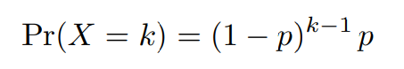
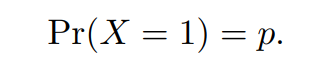
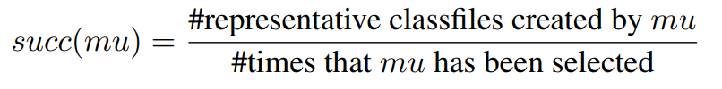
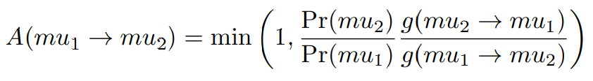
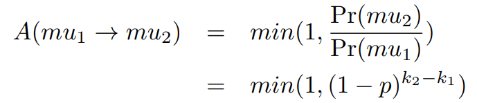
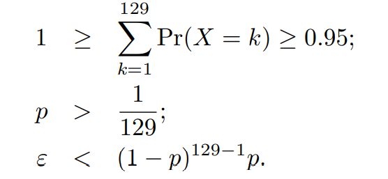
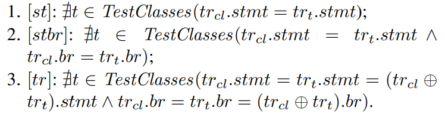
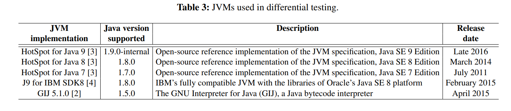
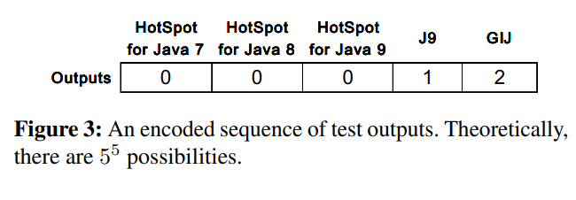

# 2 方法

本节讨论JVM测试所需的背景知识，并介绍利用代表性测试类文件的基于覆盖的方法。

## 2.1 背景：类格式和JVM启动

一个类文件在结构上进行了组织，其中包含Java类或接口的已编译代码。 它由一个魔数（'0xCAFEBABE'），一个MD5校验和值，一个常量池表以及几个可执行字节码段组成。图2显示了简化的类文件`M1436188543.class`。主要版本和次要版本指示类文件与哪个平台兼容。 例如，主版本51表示该类与J2SE 7平台兼容。 常量池存储必要的符号信息。类主体包含一个静态初始化方法`<clinit>`（即`public abstract {};`）和另一个带有代码段的`main`方法。`flags`标志用于表示类的属性（及其方法和字段）及其访问权限。 例如，这两种方法都具有`ACC_PUBLIC`标志，指示可以从其程序包外部访问这些方法；`<clinit>`具有`ACC_ABSTRACT`标志，指示该方法是抽象方法，不能实例化；`main`方法通常是静态的，因此具有`ACC_STATIC`标志等。代码段由指定要执行的操作的操作码组成。

JVM通过加载类并调用其main方法来启动。 如表1所示，JVM启动过程涉及加载，链接，初始化和调用类的步骤。 在任何步骤，违反任何约束时，JVM都可能引发内置错误和/或异常。例如，在J9上运行时，M1436188543.class会触发格式错误，该错误为`<clinit>`缺少代码属性。

## 2.2 面向覆盖的类文件变异

Classfuzz利用代表性的类文件来差异测试JVM。 如算法1所示，classfuzz选择初始的种子语料库并对其进行迭代变异（第2.2.1节）。让每个类文件在一个引用JVM上执行。任何突变体(如果被接受为差异测试的测试)在引用JVM上运行时必须采用唯一的执行路径，也就是说，测试套件中的任何两个测试应该采用不同的执行路径(2.2.3节)。新的，有代表性的类文件被进一步用作种子(算法1中的第5行和第14行)，因为我们将在3.2节中展示，通过变异有代表性的种子比变异非有代表性的种子更容易创建有代表性的类文件。

### 2.2.1 变异类文件

Classfuzz可以通过随机选择种子并将其变异来生成新的类文件。 我们利用*Soot*来变异种子，因为它是最新的Java分析和转换框架，并提供了丰富的API用于解析，转换和重写类文件。我们还定义了129个*mutators(变异算子)*，允许通过重写它们的句法结构和中间表示来突变种子;不合法的构造可能会被引入到测试类文件中，如果JVM以不同的方式处理它们，这将进一步导致JVM差异。

表2显示了一些典型的mutators。129个mutators中有123个是为在语法级别上改变类文件而设计的。Classfuzz将一个类文件读取为SootClass(即类文件的内部结构)，然后使用一个mutator来重写它(例如，修改它的修饰符，更改它的超类，添加一个接口，重命名一个字段或方法，或者删除抛出的异常)。然后生成的SootClass被转储到一个新的类文件中。

其中6个mutators旨在通过重写其Jimple文件（即类的中间表示）来更改类文件。给定一个类文件，classfuzz将其转换为一个Jimple文件。然后插入、删除或替换Jimple文件的一行或多行，这可能随机地改变类的控制流和/或语法结构。突变之后，classfuzz将突变的Jimple文件转换为另一个类文件。

为了促进进一步的JVM测试和结果分析，我们为每个classfile变量添加了一个简单的`main`方法，该方法简单地输出一条消息，指出该类可以正常加载并且`main`方法可以在JVM上正常执行。因此，当在JVM上运行时，一个突变的类文件既可以被正常调用，也可以在JVM加载和调用这个突变文件失败时触发一个错误/异常。

### 2.2.2 变异算子(Mutator)选择

这129个mutators的效果并不一样。在我们的研究中，当使用某些mutator时，classfuzz很少能生成有代表性的类文件。这一观察结果是我们设计的基础，即有选择地使用mutator来生成有代表性的类文件。

命题：突变体创建的代表性类文件越多，应选择该突变体进行进一步突变的可能性就越大。

Classfuzz采用*Metropolis-Hastings算法*来指导*mutator选择*。 Metropolis-Hastings算法是一种MCMC方法，用于从概率分布中获取随机样本。 它通过生成一个样本序列来工作，这些样本的分布非常接近所需的分布。 样本是迭代生成的，下一个样本（例如s2）的接受仅取决于当前样本（例如s1）。 在我们的设置中，样本对应于要选择的mutator。

令几何分布为符合命题的期望分布。 几何分布是获得一次成功所需的伯努利试验数量X的概率分布：如果每个试验的成功概率为p，则第k次试验为首次成功的概率为

`k`取1，2，3...， 当K等于1时，有

我们与每个突变算子`mu`关联的成功率

该成功率计算观察到突变算子`mu`创建代表类文件的频率。然后可以对突变算子进行排序，将排序的结果放在一个按成功率降序排序存储的数字`mutators`中: `mutators`中的第一个突变算子成功率最高，而最后一个突变算子成功率最低。

MCMC过程允许采样的突变算子满足几何分布，因此成功率高的突变算子比成功率低的突变算子更容易选择。 Metropolis-Hasting算法（即算法1中的6-10行）随机选择变异子，并通过*Metropolis选择*接受或拒绝变异子，其中`g(mu1→mu2)`是描述给定mu1提议新样本mu2的条件概率的提议分布。

由于这些变异体是随机选择的，所以在我们的设置中提议的分布是对称的。接受概率因此降低到

其中`k1`和`k2`分别是`mu1`和`mu2`在`mutators`中的索引。`A(mu1→mu2)`的重要性为:如果`mu2`的成功率高于`mu1`，则始终接受`mu2`;否则，建议以一定的概率`(1−p)^{k2−k1}`被选择。此外，`k2-k1`越大，接受概率越小。 请注意，在每次迭代中，都需要重新计算成功率，并对`mutators`进行重新排序（算法1中的第15-16行）。

**参数估计** 令ε是非常小的偏差（例如0.001）。 我们通过要求参数p满足三个条件来对其进行估计：

第一个条件确保累积概率接近1。第二个条件确保选择第一个突变算子（具有最高成功率）的概率必须大于`1/129`。 第三个条件确保了成功率最低的突变算子仍有一定的选择机会。 因此，p的初始值必须在(0.022, 0.025)的范围内。 在我们的研究中，我们令`p`为`3/129(≈0.023)`。

### 2.2.3 接受代表性的类文件

为了评估变异的测试，Tsankov、Dashti和Basin定义了半有效的覆盖率，这是一个计算在测试过程中使用多少半有效的输入(即，满足所有正确性约束条件，但只有一个)的覆盖率标准。

Classfuzz采用一种简单的策略，即在参考JVM RefJVM（例如HotSpot）上执行变异的类文件，并仅接受具有代表性的类文件作为测试（用于进一步的差异测试）。 特别地，我们使用覆盖唯一性作为接受或拒绝类文件的准则。

假设`TestClasses`是一组类文件，而`cl`（`cl \notin TestClasses`）是候选类文件。令`tr_cl`为执行跟踪文件，记录当`cl`在`RefJVM`上运行时，哪些JVM的代码语句和分支被`cl`击中。如果类文件`cl`的跟踪文件与`TestClasses`中的类文件的跟踪文件不同则类文件`cl`对于`TestClass`具有代表性。

通过直接比较它们的覆盖率统计信息，我们可以进一步缓解跟踪文件比较的问题。令`tr_cl.stmt`和`tr_cl.br`分别为`cl`的语句和分支覆盖率。 我们定义了以下三个条件，可以方便地检查覆盖率的唯一性：

`[st]`要求`cl`的语句覆盖范围与`TestClasses`中的类文件不同，并且`[stbr]`要求其语句及其分支覆盖范围度量标准都不同。[tr]要求cl的跟踪文件与TestClasses中任何类文件的跟踪文件在静态上有所不同（省略了程序语句和分支的执行顺序及其频率）。`⊕`是合并两个跟踪文件的运算符； 公式`trcl.stmt = trt.stmt =（trcl⊕trt）.stmt`表示`cl`和`t`覆盖了`RefJVM`的同一组程序语句； `trcl.br = trt.br =（trcl⊕trt）.br`表示两个类文件覆盖同一组分支。 与使用`[stbr]`的成本相比，`[tr]`合并跟踪文件会产生额外的成本。

## 2.3 差分测试JVM

在我们的工作中，我们在表3所示的五个最新的JVM实现上执行类文件，并比较执行结果以揭示不一致的行为。

所有的JVM都可以通过执行命令`java classname`来启动。让每个测试结果简化，通过检查主方法是否可以正常调用，或者在哪个阶段抛出错误/异常，简化为（0）"正常调用"，（1）"在加载阶段被拒绝"，（2）"在链接阶段被拒绝"，（3）"在初始化阶段被拒绝"，或者（4）"在运行时被拒绝"。然后，关于一个类文件的五个测试输出可以被编码成一个位的序列，当序列的位数不一样时，就会出现差异（例如，所有的0和所有的1）。图3展示了一个编码序列，表明一个类文件被三个HotSpot版本正常调用，但在不同阶段被J9和GIJ拒绝。请注意，简化在实践中可能会引起假阳性和阴性，因为当一个类文件包含多个非法构造时，JVM可能会报告不同的错误，而这些错误有可能在同一阶段被抛出。

同时，当出现差异时，虽然有许多通用的测试用例还原器(如AST-Based还原器和CSmith的模块化还原器)存在，但不存在任何模型或自动化手段来识别差异的根本原因。为了达到我们的目的，我们采用分层增量调试算法，分两步减少触发差异的类文件:

步骤1：给定一个触发差异（比如说`o`）的类文件`cl`，从它的`Jimple`代码中删除其中的一个方法、语句、字段，重新生成类文件（比如说`cl'`）。

步骤2：在五个JVM上重新测试`cl'`。 如果`o`保留，我们将`cl'`分配给`cl`; 否则，将丢弃`cl'`。

工程师可以重复此过程，直到获得仍然可以触发o的足够简单的类文件。 使用简化的类文件和相应的测试输出，相对容易确定导致该差异的类成分和/或属性。 确定差异是由兼容性问题还是由JVM缺陷引起的，也变得很容易。