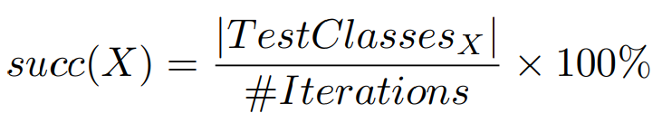
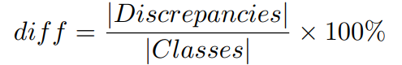
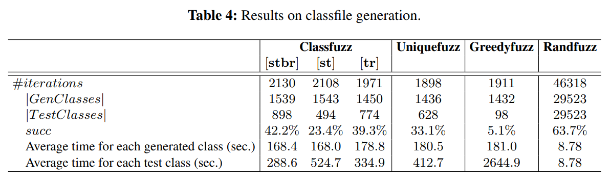
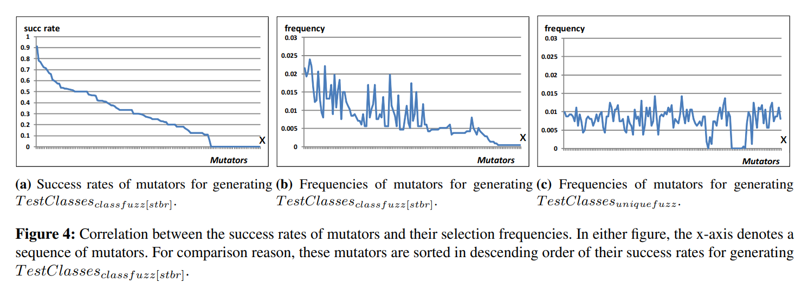

# 3 评估

我们已经实现了classfuzz，并对其与现有的模糊测试算法进行了广泛的评估。我们的评估结果显示，11%的代表性类文件可以触发JVM差异，而MCMC采样有助于产生额外43%的代表性类文件。我们还向JVM开发人员报告了62个JVM差异，以及测试类文件。这些差异大多是缺陷指示性的，或者对应于jvm所采取的相应的检查和验证策略。一些差异甚至与最近对JVM规范的Java SE 8版本的澄清和更改相符。 本节的其余部分介绍了我们的详细结果和分析。

## 3.1 安装

我们的经验评估旨在回答以下研究问题：

- *类文件*：在限定的时间内，classfuzz可以生成多少个测试类文件？
- *有效性*：classfuzz生成的测试套件中的测试类文件的有效性如何？
- *缺陷*：测试类文件可以找到任何JVM缺陷吗？

### 3.1.1 准备

我们的类文件突变和差异测试是在64位Ubuntu 14.04 LTS桌面（具有Intel Core i7-4770 CPU和16GB RAM）上进行的。如图2所示，我们选择HotSpot for Java 9作为参考JVM的原因是：(1)作为一个即将推出的JVM实现，这个版本应该在所有现有的JVM实现中提供最丰富的功能；(2)这个版本是开源的，允许方便地收集代码覆盖率(使用`--enable-native-coverage`标志)。我们使用了成熟且广泛采用的覆盖率工具GCOV + LCOV来收集覆盖率统计信息。 由于参考实现具有26万行代码（LOC），因此每次运行需要30+分钟的时间来收集覆盖率统计信息。因此，我们选择了`/hotspot/src/share/vm/classfile/`，这是一个包含JVM启动过程中使用的共享文件的软件包，用于覆盖率分析。 该软件包包含11977个LOC和9197个程序分支。 覆盖分析的成本降低到每次运行约90秒。

至于测试，我们的测试类文件是在表3所示的五个jvm上执行的。除了Java 9的HotSpot之外，所有jvm在实践中都得到了广泛的应用。

我们从JRE7库中随机选择了1,216个类文件作为种子。 我们没有使用所有JRE7的类文件，因为在有限的时间段内，可以对较少数量的种子进行更充分的突变。

此外，我们给每个突变体分配了一个主要的版本51，因为版本51类与J2SE7兼容，因此可以被Soot突变，并被所有五个JVM识别。注意，JVM可能使用不同的算法来验证不同版本的类文件。因此，HotSpot有可能接受版本46类中的一些可疑/非法构造，但如果它们出现在版本51类中，就会拒绝它们。如何创建不同版本的类文件来揭示JVM缺陷超出了本文的研究范围。

### 3.1.2 评估方法

Classfuzz可以利用三个唯一性标准中的一个(即`[st]`、`[stbr]`和`[tr]`)。为了研究哪个标准与实际中的方法很好地匹配，我们让classfuzz分别采用这些标准。相应地，将算法标记为`classfuzz[st]`，`classfuzz[stbr]`和`classfuzz[tr]`。

没有任何开源的模糊测试工具可以直接与classfuzz进行比较。AFL fuzzer是一种面向安全的fuzzer，它使用编译时检测和遗传算法来发现触发目标二进制中的新的内部状态的测试输入。但是AFL fuzzer由于许多简单的约束，无法成功生成测试类文件，例如，类文件的任何突变都会使文件违反其校验和值，种子类文件太大无法更改等。此后，我们将classfuzz与我们设计的其他三种算法进行对比评估，以证明classfuzz的能力。

- Randfuzz：它随机更改种子类文件；
- Greedyfuzz：这是一个贪婪的变异算法。Greedyfuzz测量测试套件的累积覆盖率，并且只接受导致代码覆盖率增加的突变体;
- Uniquefuzz：与classfuzz相似，uniquefuzz仅在测试套件具有唯一性时才接受突变体。 它与classfuzz的不同之处在于，它是随机选择mutator的。 在评估中，uniquefuzz仅将`[stbr]`作为其唯一性标准。

除了randfuzz之外，所有的算法都是针对覆盖率来接受/拒绝突变体，要求在每次迭代中计算代码覆盖率。每个算法取初始的种子集，但遵循各自的策略对种子和突变体进行突变。所有算法都使用2.2.1节中的129个mutators来处理类文件突变。为了便于讨论，我们将种子集、生成的类文件和为JVM测试选择的类文件分别标记为`Seeds`、`GenClasses`和`TestClasses`，并使用`GenClassesX`和`TestClassesX`表示算法`X`生成的两个集。

### 3.1.3 指标

在评估过程中，我们记录了几个指标。 我们将每种算法运行了三天，然后报告了迭代次数（`#Iterations`）以及`GenClasses`和`TestClasses`的大小。 为了解释算法中的随机性，我们对每个算法执行了5次，但只选择了5个测试套件中大小最大的一个测试套件(即`TestClasses`)和相应的`Genclass`。

我们将算法`X`的成功率计算为如下公式，它显示了算法生成测试类文件的能力。我们还报告了生成每个类文件所花费的时间。

我们通过计算在五个JVM上运行时发现的差异评估了测试套件的有效性。因此，我们在目标JVM上运行每一组类文件(`Classes`)，并按照公式计算其差异率，其中`Discrepancies`只包括可能触发JVM差异的类文件。`diff`可用于估计JVM之间的不一致：由于每个代表性的类文件都对应一个唯一的测试方案，因此`diff`越高，五个JVM在处理类文件中的不一致性就越大。

利用编码的测试结果，我们评估了每个测试套件在揭示各种差异方面的有效性。 当两个差异具有相同的编码输出时，将它们分类为一类。 我们计算了每个测试套件揭示的不同差异（`|Distinct_Discrepancies|`）的数量。 测试套件发现的差异越明显，套件应揭示的差异类型越多。

我们手动研究了`TestClasses_classfuzz[stbr]`中的每个类，并向JVM开发人员报告了一些可能是由JVM缺陷引起的差异。

## 3.2 类文件生成的结果

表4显示了测试套件的大小。从结果中，我们观察到:

发现1：`Randfuzz`生成的类文件数量是其他任何面向覆盖算法生成的类文件数量的20倍;在所有的面向覆盖算法中，`classfuzz[stbr]`生成的代表性类文件数量最多，成功率最高。

测试套件的大小可能有所不同。 在三天内，randfuzz生成了29,523个非代表性的类文件（平均每分钟6.8个类）。 同时，由于人类工程师可能花费数分钟或数小时来分析一个类文件和测试输出，因此randfuzz只是将类文件生成的成本转移到了手动结果分析上。 相反，所有定向算法生成类文件的速度均较慢。 在三天内，它们会生成1,432〜1,543个类文件（平均每分钟0.35个类），因为需要时间来（1）在运行时收集覆盖率统计数据； （2）检查每个候选类文件在测试套件方面的唯一性。 `Classfuzz[tr]`在合并跟踪文件时也会产生额外的成本。 注意，选择mutators的成本非常低，在实践中可以省去。

算法的成功率在5.1％至63.7％之间。在某些迭代过程中不会生成类文件，因为(1)一些种子是无效的，因此不能用作突变的输入，或者(2)一些SootClasses或Jimple文件重写后是无效的(例如，constant pool可能是不完整的)，并且它们的类文件不能被Soot进一步处理。定向算法（即classfuzz，greedyfuzz和uniquefuzz）由于其不唯一性，也会丢弃生成的类文件的41.7％至93.2％。

`Classfuzz[stbr]`和`classfuzz[tr]`比`classfuzz[st]`产生更具代表性的测试。原因之一是这两种算法在二维空间(即stmt和br)中接受覆盖唯一的类文件，而在一维空间中接受`classfuzz[st]`。例如，让两个类文件分别实现4938/2604和4938/2655的代码覆盖率。`Classfuzz[st]`接受一个类文件作为测试，而`Classfuzz[stbr]`同时接受两个类文件。相反，`greedyfuzz`从1432个类文件中取出98个作为代表性测试，使得差异测试不充分。

理论上，`[tr]`比`[stbr]`更强，因为具有相同覆盖率统计信息的tracefiles仍然可能不同。然而，在我们的评估中，这两个标准在接受有代表性的类文件时效果差不多。特别是，`TestClassesclassfuzz[tr]`中的774个类文件对应758个唯一的覆盖率统计;只有16个类文件具有与其他文件相同的覆盖率统计数据，但是具有不同的跟踪文件。我们将这16个类文件的输出与其他类文件的输出进行了比较，发现对于具有相同覆盖率统计数据的两个类文件，HotSpot for Java 9总是返回相同的输出。

我们从TestClassesrandfuzz中随机选择了1500个类文件。 它们仅对应237个唯一覆盖率统计数据。 相比之下，GenClassesclassfuzz [stbr]和GenClassesuniquefuzz分别对应于898和628唯一覆盖率统计。 它证明了我们在第2.2节中的假设是正确的，即，通过变异代表种子比变异非代表文件更容易创建代表类文件。

发现2：classfuzz可以利用先验知识来选择mutator。

我们总结了用于生成`TestClassesclassfuzz[stbr]`的选定器。 图4a显示了按成功率的降序排列的变异器，图4b显示了它们的频率。 尽管由于迭代不充分，选择器不能严格满足几何分布，但它显然与第2.2.1节中的主张一致：mutator的成功率越高，选择mutator的频率就越高。例如，在所有mutators中，`rename a method`的次数最多（49次），而且成功率也很高（75％）。 相比之下，如图4c所示，uniquefuzz在没有任何指导的情况下选择突变体，即使其中一些突变体很少创建有代表性的类文件；突变体的频率不同只是因为一些突变体几乎不创建类文件。

表5列出了排名前十位的mutator及其频率。 这些mutator很容易创建一组丰富的classfile变体，因为它们很可能重写需要精心处理的程序构造（例如，方法，初始化程序，异常）。某些mutator（例如，用于重写方法的参数列表的mutator）在创建覆盖唯一的类文件时不太有效，因为（1）生成的SootClasses或Jimple文件违反了SOOT中的某些转换约束，因此无法转储到类文件中，或者因为（2）某些程序构造（或属性）可以简单地处理，从而在重写之前和之后都覆盖了相同的代码来处理类构造（或属性）。

MCMC抽样在生成代表性类文件方面提供了额外的好处。通过比较`classfuzz[stbr]`和`uniquefuzz`的测试套件，我们可以估计MCMC采样有助于在三天内生成另外43%的代表性类文件。

## 3.3  JVM差分测试结果

表6总结了在五个JVM上执行种子和变异的类文件的测试结果。 通过观察结果，我们还有两个发现。

发现3：classfuzz可以将触发差异的类文件的比例从1.7％提高到11.9％。

JVM差异可能被classfile突变体放大：在21736个JRE7类文件中，只有364个可以触发JVM差异，而在`TestClassesclassfuzz[stbr]`中的898个突变体中，有107个可以触发JVM差异。结果表明：（1）经测试的JVM实现与大多数类文件兼容，而在处理某些特殊情况时仍然有所不同； （2）模糊测试是揭示JVM差异的一种有前途的方法。

表7给出了在`TestClassesclassfuzz[stbr]`中使用898类文件突变体进行差异测试的详细摘要：127、127、125、123和145类文件分别可在三个HotSpot版本J9和GIJ上运行。J9拒绝最多的类文件，而GIJ拒绝最少的类文件。 从结果中我们注意到，在JVM中，GIJ是最宽容的，并且接受更多的无效类文件。

发现4：`TestClassesclassfuzz[stbr]`可以揭示所有测试套件中最多的独特差异（distinct discrepancies）。

表6显示了TestClassesclassfuzz [stbr]揭示了比其他测试套件更独特的差异。 TestClassesclassfuzz [stbr]揭示的一组独特差异也可以包含除Seeds之外的其他测试套件所揭示的差异。这表明TestClassesclassfuzz [stbr]在揭示各种JVM差异方面是有效的。 相反，randfuzz可以生成大量的类文件，这些类文件会触发5537个JVM差异，而这些差异只能减少到14个不同。

`classfuzz[stbr]`的GenClasses和TestClasses可以揭示相同数量的独特差异，而其他算法则不能。因此，从独特差异的角度来看，`TestClassesclassfuzz[stbr]`可以替代`GenClassesclassfuzz[stbr]`来差异测试五个JVM。

**差异分析**  JVM差异以前没有得到太多研究。 的确，很少有人向JVM开发人员报告过它们，并且也不为人所知。我们研究了几个Java和jvm的bug跟踪系统、邮件列表和论坛，并选择了最活跃的几个:Java的一个bug跟踪器和HotSpot的两个邮件列表。我们在邮件列表中搜索了2013年1月至2015年12月之间的消息，但没有发现任何主题与JVM差异有关。我们在错误跟踪器中搜索了与GIJ和J9相关的错误。 仅检索了五个错误，这些错误未明确报告为JVM差异。有趣的是，在这些邮件列表和bug跟踪器中提出的许多更改可能会被用来发现JVM差异，我们计划在未来的工作中探索这些差异。

我们的测试类文件清楚地指出了JVM差异的存在。我们手动分析了TestClassesclassfuzz[stbr]中的类文件及其测试输出，并收集了62个JVM差异和简化的类文件。据我们所知，这些差异以前是未知的：62个差异中的28个表示在一个或多个JVM实现中存在缺陷。 由于JVM采用不同的验证/检查策略或对资源和库具有不同的可访问性，因此导致30个差异。 其余4个对应于兼容性问题。下面列出了我们报告的一些问题。我们还将说明如何对类文件进行突变以发现这些问题。

**问题1：** JVM规范中的 "类文件中其他名为`<clinit>`的方法没有任何后果 "的条款造成了不合理的混乱。

图2中的程序揭示了HotSpot和J9之间的行为差异。特别地，`public abstract <clinit>` 既可以用通过将一个抽象方法命名为`<clinit>`来创建也可以通过对`<clinit>`方法添加`ACC_ABSTRACT`标志并删除其操作码来创建。由于方法`<clinit>`没有`ACC_STATIC`标志，因此HotSpot将其视为普通方法而不是初始化方法，而J9则引发ClassFormatError。

我们报告的问题已被确认为JVM规范中的缺陷和J9中的错误。 它还符合最近的规范说明。规范委员会将在JVM规范的2.9节中进行修订，其中将更严格地定义类/接口初始化方法：“如果满足以下所有条件，则方法是类或接口初始化方法：（1）它具有特殊名称`<clinit>`； （2）没有参数； （3）void方法； （4）在版本号为51.0或更高版本的类文件中，该方法已设置其`ACC_STATIC`标志。 类文件中其他名为`<clinit>`的方法不是类或接口初始化方法。”

SE 9之后的JVM必须对所有类文件版本应用以上新的定义。 相应的技术兼容性套件（JCK）测试正在开发中。

**问题2：** JVM采取各自的类文件验证和类型检查策略。

由于JVM采取的类文件验证和类型检查策略不同，可能导致差异。如果删除内部语句或添加新语句，则方法可能变得非法，并且使用此类方法的类可能会暴露JVM在格式检查和类文件验证中的差异。甚至JVM开发人员都不熟悉某些差异。 例如，IBM的VM J9不如HotSpot严格，因为J9仅在调用时验证一个方法，而HotSpot在执行之前验证所有方法。 这个事实不是众所周知的。

对于合并了初始化和未初始化类型的方法，GIJ可以报告验证错误，但HotSpot不能。

HotSpot缺失了一些不兼容的类型转换错误捕获。例如，通过将方法internalTransform的唯一参数的类型从`java.util.Map`设置为`java.lang.String`来对M1433982529类进行突变。 GIJ会为该类抛出一个验证错误，因为在`java.lang.String`和`java.util.Map`之间执行类型转换是不安全的，而HotSpot不会为此报告任何错误。 在其他一些类型转换中也会发生相同的问题，例如，在`java.lang.Boolean`和`java.util.Enumeration`之间。

**问题3：** JVM不兼容访问某些类。

经过测试的JVM访问某些类的策略不同。例如，考虑下面显示的类`sun.java2d.pisces.PiscesRenderingEngine`的源代码。 生成类`PiscesRenderingEngine$2`用于初始化`NormMode`。 我们将抛出`PiscesRenderingEngine$2`的异常添加到类M1437121261的`main`方法中。 HotSpot报告类M1437121261的`java.lang.IllegalAccessError`，而J9和GIJ则没有。

**问题4：** GIJ的行为与HotSpot和J9明显不同。

GIJ 5.1.0符合Java 1.5.0，虽然它可以处理51版本的类。因此，它的行为与其他符合Java 1.7.0、1.8.0或1.9.0-内部的JVM有很大不同，而许多差异是明显的JVM缺陷。其中一些差异是：

- 在处理一个继承类如 `java.lang.Exception` 的接口时，HotSpot和J9都会抛出 ClassFormatError 因为接口的超类一定要是 java.lang.Object， 但是GIJ无法捕获这种非法继承结构。可以通过更改接口超类来获取触发此差异的接口。
- 除GIJ之外的所有JVM都要求接口方法必须是`public`和`abstract`的，并且接口字段必须是`public`，`static`和`final`的。 可以通过更改其方法或字段之一的修饰符来获得此接口。
- GIJ可以执行具有`main`方法的接口（即`public static main(String [])`），而其他JVM则不能。 可以通过将`main`方法插入种子接口来创建这样的接口。
- `public abstract void <init> (int, int, boolean);` 方法标识会被所有JVM拒绝，除了GIJ。HotSpot和J9拒绝是因为`<init>`不应该是`static`，`final`，`synchronized`，`native` 或者`abstract`。同样，方法标识如`public java.lang.Thread <init>()` 在GIJ是被允许的，但是在HotSpot和J9中却是被拒绝的，因为`<init>`不应该返回任何结果。通过更改修饰符或`<init>`的返回类型，可以创建为此的类文件突变体。
- GIJ 接受有重复字段的类，但是其他JVM不接受。可以通过插入种子中存在的一个或多个类字段来创建为此的类文件突变体。